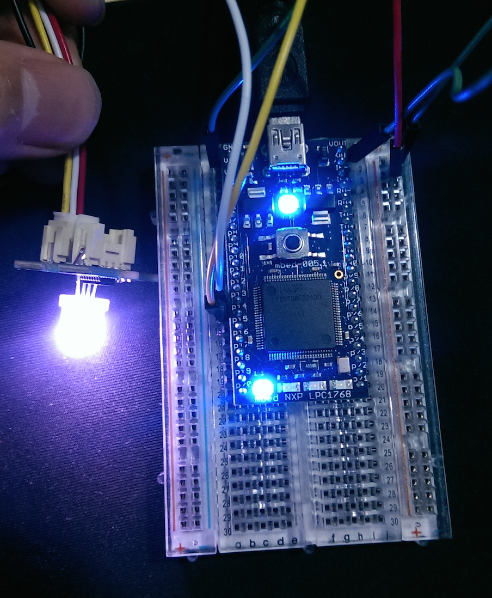

# Grove Chainable RGB LED
RGB LED 原理是將三原色的 LED 封裝在同一個 LED 內，利用三原色的混色達到顯示各色的效果。本文使用的 [RGB LED 為此](http://www.seeedstudio.com/depot/Grove-3Axis-Digital-Accelerometer15g-p-765.html)。


圖1 Chainable RGB LED


## 腳位接法

| RGB LED pin | Mbed pin   |
| -------- | ---------- |
| 1 - RX   | P14 - RX   |
| 2 - TX   | P13 - TX   |
| 3 - Vcc  | Vout - 3.3V|
| 4 - GND  | GND        |



圖2 RGB LED 腳位接法

備註：ARM Mbed 腳位只要是 RX 及 TX 即可，以 LPC1768 為例：P10 & P9、P27 & P28 也可使用。	


##函式庫介面

```
class ChainableLED {
      public:
        ChainableLED(byte clk_pin, byte data_pin, byte number_of_leds);

        void setColorRGB(byte led, byte red, byte green, byte blue);
        void setColorHSB(byte led, float hue, float saturation, float brightness);
    }
```


## 程式碼

開始撰寫 ARM mbed 程式碼。首先，必須引入 mbed.h 及 ChainableLED.h 標頭檔，接著將連接腳位。並且我們利用 wait 函數使 RGB LED 隨時間產生變化。

```
#include "mbed.h"
#include "ChainableLED.h"
 
// ChainableLED(clk, data, number_of_leds)
ChainableLED color_led(p14, p13, 1);
 
int main() {
    uint8_t value = 0;
    
    while(1) {
        value++;
        // ChainableLED.setColorRGB(index_of_led, red, green, blue)
        color_led.setColorRGB(0, value, 255 - value, value + 80);
        wait_ms(10);
    }
}
```


## 參考資料
*https://developer.mbed.org/components/Grove-Chainable-RGB-LED/
*https://developer.mbed.org/teams/Seeed/wiki/Grove-Chainable-RGB-LED
*https://github.com/pjpmarques/ChainableLED/wiki
